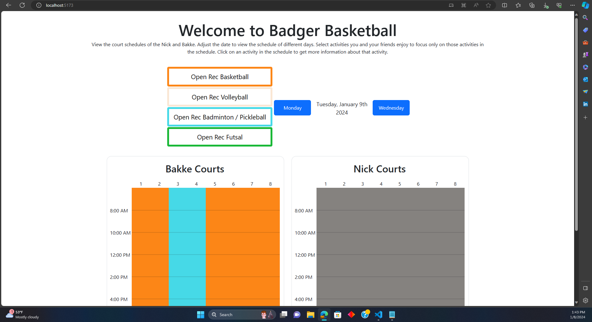
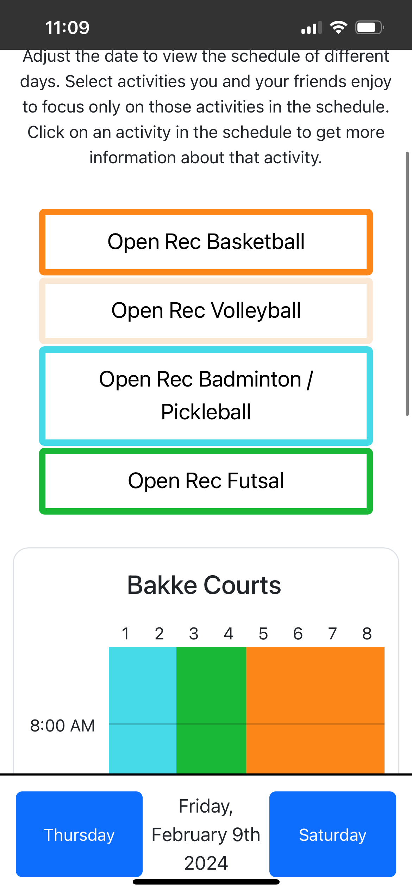
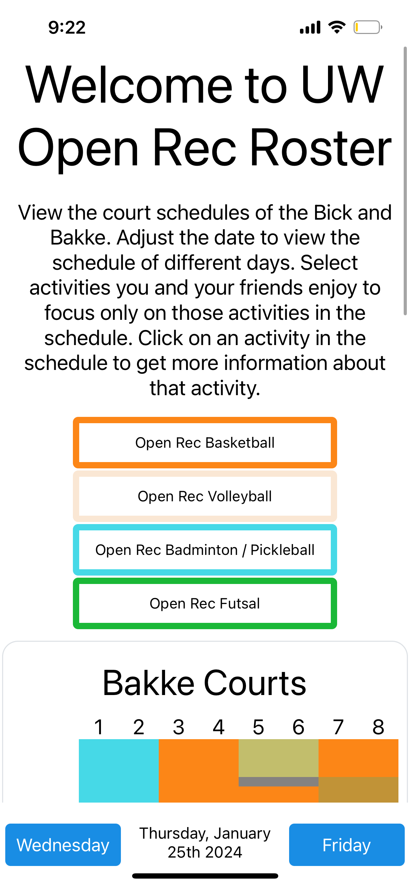

# Welcome to Badger Basketball

A pet project by Hayden Dippel and Bailey Kau to more easily display and view the basketball court schedules at the two gyms, the Nick and the Bakke, at UW-Madison 🦡.

Go Badgers!!

## 🥳🥳🥳 The [site](https://www.uwopenrecroster.com) is up 🥳🥳🥳

Super excited to annouce that the site is up. To view the website, head to [www.uwopenrecroster.com](https://www.uwopenrecroster.com)!

<div style='display: flex; gap: 3vw'>
    
    
</div>

## For Developers

There are currently three directories in this repo, [Frontend](#frontend), [Backend](#backend), and [Mobile](#mobile). Frontend contains all the html, css, and js used in the project. React with Vite was used in this project. Backend is at [https://www.uwopenrecrosterbackend.xyz](https://www.uwopenrecrosterbackend.xyz/data) with the parameters date and gym. An example is [https://www.uwopenrecrosterbackend.xyz/data?date=2024-01-25&gym=Bakke](https://www.uwopenrecrosterbackend.xyz/data?date=2024-01-25&gym=Bakke), which grabs the gym schedule at the Bakke for January 25, 2024.

To run this project locally, open a terminal and git clone the repo

```
git clone https://github.com/HaydenDippL/BadgerBasketball.git
cd BadgerBasketball
```

Navigate to the Frontend and run the following commands

```
cd Frontend
npm install
npm run dev
```

Open another terminal inside the BadgerBasketball project and navigate to the backend and run the following commands

```
cd Backend
npm install
npm run dev
node sql/init.schedules.js
```

Ensure that you comment out the `logging` and `query` import statements at the top of `app.js` aswell as the `logging` call in `app.get('/data')` Leaving this code in would attempt to connect you with our DB, which you do not have privelages to access, or the password.

Additionally, navigate to `src/components/Schedule.jsx` and find the fetch statements. There are two, one for the actual backend, and one for your local backend, comment out the offical backend and un-comment the local backend. Now you will call your local backend.

Now you can navigate to [http://localhost:5173](http://localhost:5173) and view the locally run website. The backend is run through port `3999`, [http://localhost:3999/data?date=2024-01-22&gym=Bakke](http://localhost:3999/data?date=2024-01-22&gym=Bakke).

---

If you would like to locally run the app navigate to the Mobile folder and then run the following

```
cd Mobile
npm install
npm start
```

Make sure to have downloaded Expo Go on your phone and scan the qr code in the terminal once it appears. Unfortunately, I do not know a way to run the local backend with the Mobile dev build... you just connect to the cloud backend.

### Frontend

Once in the `Frontend` folder, you can find the source code in `src`. The main file is `src/App.jsx`. Here is the root of all the jsx code. Then in `src/components` are 

- `DateForm.jsx`: The buttons used to manipulate the date and date display itself
- `Legend.jsx`: The button group used to select preferences, and highlight only the sports you want highlighted in the schedules
- `PreferenceButton.jsx`: The buttons used in Legend.jsx
- `Schedule.jsx`: The schedule of the gyms

CSS files are found in `src/styles` for each component.

`src/helper` contains some basic helper functions and variables for dates and colors.

### Backend

No IP can call this backend more the <ins><b>20 times a second</b></ins>!

The backend memoizes daily schedules from the current day to 2 weeks in the future. Once the day ends and a user calls the API the next morning, the backend forgets all of the schedules and starts anew. 

The backend also now logs users data in a TiDB database with two tables: sessions and queries

Queries stores:

- `date_queried`: the date that the user requested.
- `gym`: the gym that the user requested.
- `gym_facility`: the facility that was requested. As of now the only facilities are 'Courts' but may include the pools, tracks, ice rinks, etc...
- `session_id`: uuid4 key that is assigned to each user every time they use the website to group queries into a sessions through the sessions table.

Sessions stores:

- `session_id`:
- `IP`: used to track unique users.
- `num_queries`: number of queries the user has made in this session, denoted by the session_id.
- `date_of_queries`: what date the queries were made on.
- `time_of_queries`: what time the queries were made on.
- `device`: what device the user used (OS).
- `browser`: what browser the user used.

Backend is stored at through nginx ... 

```
/var/www/ ...
```

#### API

- Local routes are relative to http://localhost:3999/
- Backend routes are relative to https://www.uwopenrecrosterbackend.xyz/

| Method | URL | Formatting | Purpose&emsp;&emsp;&emsp;&emsp;&emsp;&emsp;&emsp;&emsp;&emsp;&emsp;&emsp; | Return Codes |
|:-:|:-:|:-:|:--|:-:|
| `GET` | `/data?date=2024-01-25&gym=Bakke` | The date parameter must be of the form yyyy-mm-dd. There are two options for gym: 'Bakke' and 'Nick'. | This fetches the schedule for the designated date and gym in the following format:<br>\[<br>&emsp;{<br>&emsp;&emsp;"EventName": "Open Rec Futsal",<br>&emsp;&emsp;"Location": "Courts 3 - 4",<br>&emsp;&emsp;"EventStart": "2024-01-22T06:00:00",<br>&emsp;&emsp;"EventEnd": "2024-01-23T00:00:00"<br>&emsp;},<br>&emsp;...<br>\]<br>Where the times are of the form yyyy-mm-ddThh-mm-ss and the time 00:00:00 represents midnight. | 200, 400 |
| `GET`| `/analytics` | There are nine optional parameters for getting different analytics. Marking one as true will fetch it for you, marking as false or excluding the argument altogether will not fetch it for you.<br><br>`get_total_users`: gets the full number of unique users on that have used the site<br>`get_total_visites`: gets the total number of visits to the site<br>`get_total_queries`: gets the total number of queries to the `/data` API, which is equal to the total number of schedules displayed<br>`get_users_over_time`: gets the total number of users over time<br>`get_days_activity_count`: gets bar chart data for on which days users query the site<br>`get_days_viewed_count`: gets bar chart date for which days users query<br>`get_future_views`: sees how far into the future users view<br>`get_device_count`: gets the total number of queries by each type of device<br>`get_browser_count`: gets the total number of queries by each type of browser | This grabs data for users to analyze and for the `/analytics` extension of the site for users to view. | 200

### Mobile

The Mobile version of the app has not been deployed yet, but the dev build is up and working on your local machine.



A key difference between the web and mobile versions is that the date controls a fixed at the bottom of the screen to make it easier for those navigating.

The layout of the code is nearly identical to Frontend, with a few minor caveats.

## What's Next 🧐!

Expand the site to include other open rec facilities in the Bakke and Nick: the ice rink, pools, tracks, esports rooms, and or group fitness.