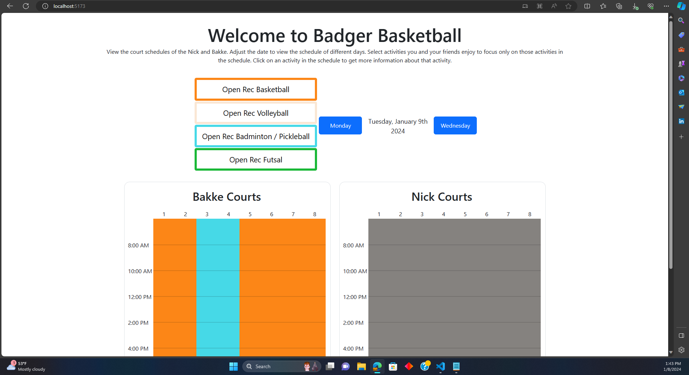

# Welcome to Badger Basketball

A pet project by Hayden Dippel and Bailey Kau to more easily display and view the basketball court schedules at the two gyms, the Nick and the Bakke, at UW-Madison 🦡.

Go Badgers!!

## 🥳🥳🥳 The [site](https://www.uwopenrecroster.com) is up 🥳🥳🥳

Super excited to annouce that the site is up. To view the website, head to [www.uwopenrecroster.com](https://www.uwopenrecroster.com)!



## For Developers

There are currently two directories in this repo, [Frontend](#frontend) and [Backend](#backend). The links take you to the documentation for the respective directories. Frontend contains all the html, css, and js used in the project. React with Vite was used in this project. The backend is at [https://www.uwopenrecrosterbackend.xyz](https://www.uwopenrecrosterbackend.xyz) with the parameters date and gym. An example is [https://www.uwopenrecrosterbackend.xyz/data?date=2024-01-25&gym=Bakke](https://www.uwopenrecrosterbackend.xyz/data?date=2024-01-25&gym=Bakke), which grabs the gym schedule at the Bakke for January 25, 2024.

To run this project locally, open a terminal and git clone the repo

```
git clone https://github.com/HaydenDippL/BadgerBasketball.git
cd BadgerBasketball
```

Navigate to the Frontend and run the following commands

```
cd Frontend
npm install
npm run dev
```

Open another terminal inside the BadgerBasketball project and navigate to the backend and run the following commands

```
cd Backend
npm install
npm run dev
```

Now you can navigate to [http://localhost:5173](http://localhost:5173) and view the locally run website. The backend is run through port `3999`, [http://localhost:3999/data?date=2024-01-22&gym=Bakke](http://localhost:3999/data?date=2024-01-22&gym=Bakke).

Additionally, navigate to `src/components/Schedule.jsx` and find the fetch statements. There are two, one for the actual backend, and one for your local backend, comment out the offical backend and un-comment the local backend. Now you will call your local backend.

### Frontend

Once in the `Frontend` folder, you can find the source code in `src`. The main file is `src/App.jsx`. Here is the root of all the jsx code. Then in `src/components` are 

- `DateForm.jsx`: The buttons used to manipulate the date and date display itself
- `Legend.jsx`: The button group used to select preferences, and highlight only the sports you want highlighted in the schedules
- `PreferenceButton.jsx`: The buttons used in Legend.jsx
- `Schedule.jsx`: The schedule of the gyms

CSS files are found in `src/styles` for each component.

`src/helper` contains some basic helper functions and variables for dates and colors.

### Backend

No IP can call this backend more the <ins><b>20 times a second</b></ins>!

The Backend is set to memoize the schedules on a daily basis, using `sqlite3` as to not overload the underlying recwell API. 

- Local routes are relative to http://localhost:3999/
- Backend routes are relative to https://www.uwopenrecrosterbackend.xyz/

| Method | URL | Formatting | Purpose&emsp;&emsp;&emsp;&emsp;&emsp;&emsp;&emsp;&emsp;&emsp;&emsp;&emsp; | Return Codes |
|:-:|:-:|:-:|:--|:-:|
| `GET` | `/data?date=2024-01-25&gym=Bakke` | The date parameter must be of the form yyyy-mm-dd. There are two options for gym: 'Bakke' and 'Nick'. | This fetches the schedule for the designated date and gym in the following format:<br>\[<br>&emsp;{<br>&emsp;&emsp;"EventName": "Open Rec Futsal",<br>&emsp;&emsp;"Location": "Courts 3 - 4",<br>&emsp;&emsp;"EventStart": "2024-01-22T06:00:00",<br>&emsp;&emsp;"EventEnd": "2024-01-23T00:00:00"<br>&emsp;},<br>&emsp;...<br>\]<br>Where the times are of the form yyyy-mm-ddThh-mm-ss and the time 00:00:00 represents midnight. | 200, 400 |

Future plans would include logging

## What's Next 🧐!

The next set of plans is to create a new directory in this repo --- a mobile app folder with react native code! It would be available for both iOS and Android and would make it even more accessible and helpful for our users.

Additionally we want to create a dashboard website with the analytics of the website and the app, displaying user counts and a map of madison diplaying all of our users.