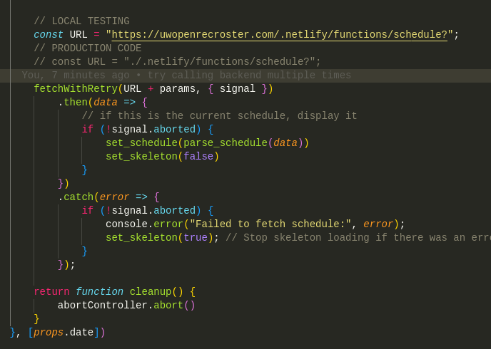

# Welcome to Badger Basketball

A pet project by Hayden Dippel and Bailey Kau to more easily display and view the basketball court schedules at the two gyms, the Nick and the Bakke, at UW-Madison 🦡.

Go Badgers!!

## 🥳🥳🥳 The [site](https://www.uwopenrecroster.com) is up 🥳🥳🥳

Super excited to annouce that the site is up. To view the website, head to [www.uwopenrecroster.com](https://www.uwopenrecroster.com)!

<div style='display: flex; gap: 3vw'>
    
    
</div>

## For Developers

This is a fullstack site which displays the courts schedules of the Nick and Bakke gyms at UW-Madison. It is a react app hosted on Netlify with a serverless backend to retrieve the schedules from UW Recwell and to log usage of the site itself. The serverless functions are connected to a TiDB server which collects analytics.

There are two directories in this repo: [Frontend](#frontend), and [Mobile](#mobile). Frontend contains the react project along with the serverless Netlify [Backend](#backend)


To run this project locally, open a terminal and git clone the repo

```
git clone https://github.com/HaydenDippL/BadgerBasketball.git
cd BadgerBasketball
```

Then you will to go into `Frontend/src/components/Schedule.jsx` and ensure that the LOCAL code is uncommented and the production code is commented out, as such...



You must comment out this code because you don't have access to the TiDB database.

Then, navigate to the Frontend and run the following commands

```
cd Frontend
npm install
npm run dev
```

Now you can navigate to [http://localhost:5173](http://localhost:5173) and view the locally run website.

---

If you would like to locally run the app navigate to the Mobile folder and then run the following

```
cd Mobile
npm install
npm start
```

Make sure to have downloaded Expo Go on your phone and scan the qr code in the terminal once it appears. Unfortunately, I do not know a way to run the local backend with the Mobile dev build... you just connect to the cloud backend.

## For Hayden

In order to locally test the app run 

```
netlify dev
```

- Domain Name Service: Dreamhost
- Frontend Hosting: Netlify
- Database: TiDB

The frontend will try to call the serverless backend 5 times before failure, due to potential spin up times.

### Frontend

Once in the `Frontend` folder, you can find the source code in `src`. The main file is `src/App.jsx`. Here is the root of all the jsx code. Then in `src/components` are 

- `DateForm.jsx`: The buttons used to manipulate the date and date display itself
- `Legend.jsx`: The button group used to select preferences, and highlight only the sports you want highlighted in the schedules
- `PreferenceButton.jsx`: The buttons used in Legend.jsx
- `Schedule.jsx`: The schedule of the gyms

CSS files are found in `src/styles` for each component.

`src/helper` contains some basic helper functions and variables for dates and colors.

### Backend

The 'backend' are two Netlify serverless functions. The first function is [`schedule`](#api) which will retrieve a recwell schedule, and log the request. The log tables are as follows...

Queries stores:

- `date_queried`: the date that the user requested.
- `gym`: the gym that the user requested.
- `gym_facility`: the facility that was requested. As of now the only facilities are 'Courts' but may include the pools, tracks, ice rinks, etc...
- `session_id`: uuid4 key that is assigned to each user every time they use the website to group queries into a sessions through the sessions table.

Sessions stores:

- `session_id`: a uuid for their session
- `IP`: used to track unique users.
- `num_queries`: number of queries the user has made in this session, denoted by the session_id.
- `date_of_queries`: what date the queries were made on.
- `time_of_queries`: what time the queries were made on.
- `device`: what device the user used (OS).
- `browser`: what browser the user used.

#### API

Routes are relative to https://www.uwopenrecroster.com/.netlify/functions/.

This is an open API that anyone can call.

| Method | URL | Formatting | Purpose&emsp;&emsp;&emsp;&emsp;&emsp;&emsp;&emsp;&emsp;&emsp;&emsp;&emsp; | Return Codes |
|:-:|:-:|:-:|:--|:-:|
| `GET` | `/schedule?date=2024-01-25&gym=Bakke$gym_facility=Courts` | The date parameter must be of the form yyyy-mm-dd. There are two options for gym: 'Bakke' and 'Nick'. You must specify the gym facility of Courts | This fetches the schedule for the designated date and gym in the following format:<br>\[<br>&emsp;{<br>&emsp;&emsp;"EventName": "Open Rec Futsal",<br>&emsp;&emsp;"Location": "Courts 3 - 4",<br>&emsp;&emsp;"EventStart": "2024-01-22T06:00:00",<br>&emsp;&emsp;"EventEnd": "2024-01-23T00:00:00"<br>&emsp;},<br>&emsp;...<br>\]<br>Where the times are of the form yyyy-mm-ddThh-mm-ss and the time 00:00:00 represents midnight. | 200, 400 |
| `GET`| `/analytics` | There are nine optional parameters for getting different analytics. Marking one as true will fetch it for you, marking as false or excluding the argument altogether will not fetch it for you.<br><br>`get_total_users`: gets the full number of unique users on that have used the site<br>`get_total_visites`: gets the total number of visits to the site<br>`get_total_queries`: gets the total number of queries to the `/data` API, which is equal to the total number of schedules displayed<br>`get_users_over_time`: gets the total number of users over time<br>`get_days_activity_count`: gets bar chart data for on which days users query the site<br>`get_days_viewed_count`: gets bar chart date for which days users query<br>`get_future_views`: sees how far into the future users view<br>`get_device_count`: gets the total number of queries by each type of device<br>`get_browser_count`: gets the total number of queries by each type of browser | This grabs data for users to analyze and for the `/analytics` extension of the site for users to view. | 200

### Mobile

The Mobile version of the app has not been deployed yet, but the dev build is up and working on your local machine.


A key difference between the web and mobile versions is that the date controls a fixed at the bottom of the screen to make it easier for those navigating.

The layout of the code is nearly identical to Frontend, with a few minor caveats.

## What's Next 🧐!

Expand the site to include other open rec facilities in the Bakke and Nick: the ice rink, pools, tracks, esports rooms, and or group fitness.